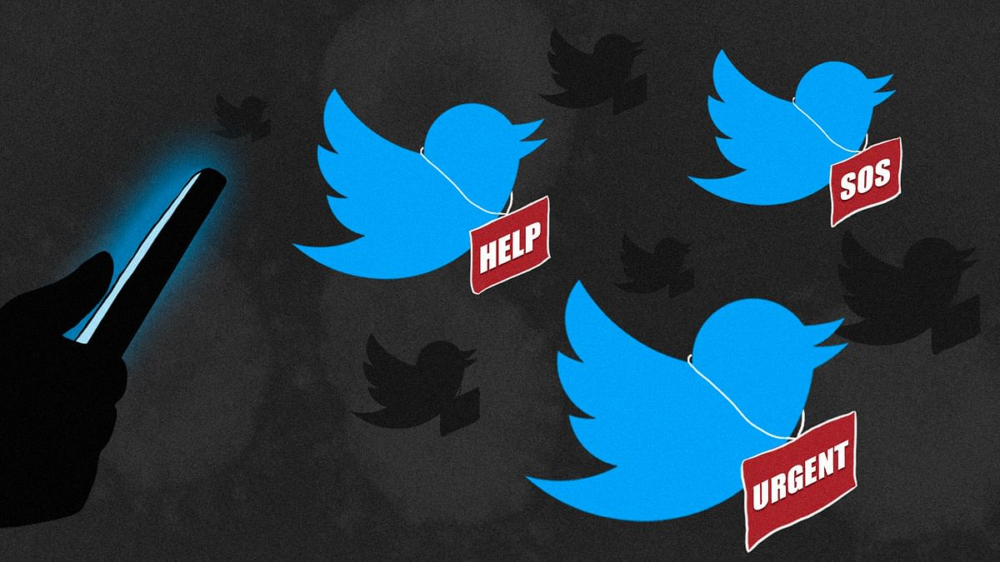

# NLP-with-Disaster-Tweets-Kaggle-Competition
Introductory project to NLP developed for a Kaggle competition - [Natural Language Processing with Disaster Tweets](https://www.kaggle.com/c/nlp-getting-started)

## Project description
Twitter has become an important communication channel in times of emergency. The ubiquitousness of smartphones enables people to announce an emergency they’re observing in real-time. Because of this, more agencies are interested in programatically monitoring Twitter (i.e. disaster relief organizations and news agencies). The purpose of this project is to build a machine learning model that predicts which Tweets are about real disasters and which one’s aren’t. Classification is done primarily by the content of the tweet.

  

## Tags
NLP, machine learning, Exploratory Data Analysis (EDA), data viz, Pandas, matplotlib, seaborn, NLTK, scikit-learn

## Project contents:
- Data exploration and visualisation:
  - Distribution of the two classes
  - Length of tweets and average number of words
  - Most common words analysis
  - Most common punctuation analysis
  - Location data analysis
- Data cleaning:
  - Removing urls, html, emojis and punctuation
  - Stemming and removing stopwords
- Modelling:
  - Bag of words implementation
  - Comparison of three algorithms - Logistic regression, SVM and Decision Trees
- Evaluation:
  - F1 score
  - Accuracy
  - AUROC
